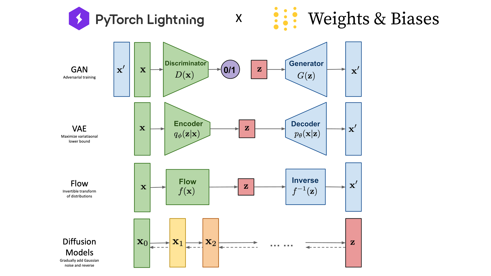
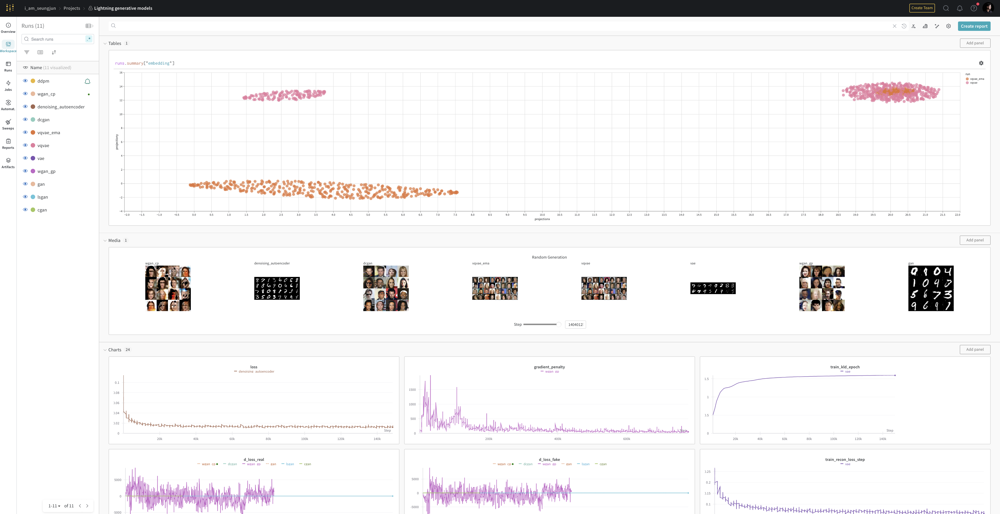

#  ⚡️Lightning Generative Models


Harness the capabilities of **[PyTorch Lightning](https://lightning.ai/)** and **[Weights & Biases (W&B)](https://wandb.ai/site)** to implement and train a variety of deep generative models, while seamlessly logging your experiments.

## Wandb Experiment Logging
**Weights & Biases** provides machine learning developers tools to track their experiments, visualize model training and metrics, and optimize machine learning models.
The figure below is an example of the experiments logging interface on the Wandb platform.


Visit the [Wandb Experiment Page](https://wandb.ai/i_am_seungjun/Lightning%2520generative%2520models?workspace%253Duser-i_am_seungjun) for more details.

## 🌟 Models

- GANs
    - [GAN](models/generative/gan/gan.py)
    - [CGAN](models/generative/gan/cgan.py)
    - [DCGAN](models/generative/gan/dcgan.py)
    - [LSGAN](models/generative/gan/lsgan.py)
    - [WGAN](models/generative/gan/wgan.py)
    - (Upcoming) [CycleGAN](models/generative/gan/cyclegan.py)

- VAEs
    - [VAE](models/generative/vae/vae.py)
    - [VQVAE](models/generative/vae/vqvae.py)

- Autoregressive Models
    - (Upcoming) PixelCNN

- Normalizing Flows
    - (Upcoming) NICE (Non-linear Independent Components Estimation)
    - (Upcoming) RealNVP
    - (Upcoming) Glow

- Diffusion Models
    - (Upcoming) DDPM
    - (Upcoming) DDIM

## 📊 Evaluation Metrics
Assess the quality and performance of your generative models with:

1. Inception Score (IS)
2. Fréchet Inception Distance (FID)
3. Precision and Recall Distribution (PRD)
4. Density and Coverage metrics
5. Reconstruction-FID

## 🔧 Installation

**macOS M1 support**: This repository is tested and compatible with the macOS M1 with GPU acceleration.

```bash
# Clone the repository
git clone https://github.com/seungjunlee96/lightning-generative-models.git
cd lightning-generative-models

# Set up a conda environment
conda create -n lightning-generative-models python=3.11 -y
conda activate lightning-generative-models
pip install -r environments/requirements.txt

# For contributors
pre-commit install
```


## 🚀 Usage
### (1) Download data
While automatic dataset downloading is supported, some datasets (e.g., LSUN) require manual downloading:

```bash
chmod +x ./data/download_lsun.sh
./data/download_lsun.sh
```

### (2) Run `train.py`
Use the `config` parser with `train.py`, for example:

```bash
# Train GAN with MNIST
python train.py --config configs/gan/gan.json --experiment_name gan

# Train LSGAN
python train.py --config configs/gan/lsgan.json --experiment_name lsgan

# Train CGAN
python train.py --config configs/gan/cgan.json --experiment_name cgan

# Train DCGAN
python train.py --config configs/gan/dcgan.json --experiment_name dcgan

# Train WGAN with weight clipping
python train.py --config configs/gan/wgan_cp.json --experiment_name wgan_cp

# Train WGAN with gradient penalty
python train.py --config configs/gan/wgan_gp.json --experiment_name wgan_gp

# Train VAE
python train.py --config configs/vae/vae.json --experiment_name vae

# Train VQVAE
python train.py --config configs/vae/vqvae.json --experiment_name vqvae

# Train VQVAE with EMA (Exponential Moving Average)
python train.py --config configs/vae/vqvae_ema.json --experiment_name vqvae_ema

# ... and many more
```

## 🤝 Contributing
All contributions are welcome! Open an issue for discussions or submit a pull request directly.

## 📩 Contact
For queries or feedback, email me at lsjj096@gmail.com.

## 📚 References
This repo is highly motivated by below amazing works:
- https://github.com/nocotan/pytorch-lightning-gans
- https://nn.labml.ai/
- https://github.com/eriklindernoren/PyTorch-GAN